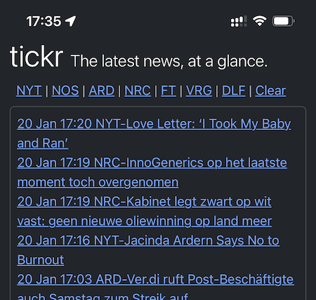

# Reader

Reader is a simple web-based RSS reader written in Go.

It polls RSS feeds and displays them in a "news ticker" style: A timestamp, a tag identifying the source, and a headline. 



## Breaking news

Reader includes headline scoring using gpt-3.5-turbo through the OpenAI API. The model is prompted to identify high-priority news through the system prompt. 

The system prompt is editable; it can be set using the `-promptfile` option when launching reader. If no prompt file is present, the default is used (see `const defaultPrompt` in the `internal/openai` package).

In addition, the last 10 top-scoring headlines are retrieved from the database in real time and appended to the system prompt as context to avoid duplication of recent headlines.

To ensure we get valid JSON back from the model, we use the `response_format` option ([see API docs](https://platform.openai.com/docs/api-reference/chat/create#chat-create-response_format)). 

(Using gpt-4 did not appear to meaningfully improve performance, so we went with the cheaper option.)

## Installation

I have Reader running in production behind a NGINX reverse proxy. 

### Production

Clone repo from git. Build with go.

Create a small script that will start reader (setting certain command-line flags, for instance).

Then, create a file `reader.service` and save it into `~/.config/systemd/user`:

```systemd
[Unit]
Description=Reader, a simple RSS reader
After=network.target

[Service]
ExecStart=[...path...]/reader.sh
Type=Simple

[Install]
WantedBy=default.target
RequiredBy=network.target
```

system.d should pick it up from there.

> [!WARNING]
> When running `start/stop/restart/enable` etc., you need to use `systemctl --user`. Without the `--user` option, systemctl will not find the service file.
> Additionally, a user script running with systemd only starts at login, not at boot. Run `loginctl enable-linger [username]` to have Reader start at boot.


### Dev / testing

For **local testing**, create a directory `./db/` in the work directory (Reader will store the sqlite database there), copy the sample config file into the same directory, rename it `config.yaml` and edit it as appropriate. Then you can run Reader with `go run .` (potentially adding the flag `-ai=false` to save OpenAI API costs) and access it in a browser at `localhost:8000`.

### Account creation

- The first time that Reader runs, it will allow anyone to create an account. On the homepage, enter a user name and password and click 'register'. Once you've done this, registrations will automatically close and nobody else can create an account. (I'm assuming that this is a single-user instance.)
- *Troubleshooting:* Account creation is only open when Reader starts up and does not find a database. So if you started Reader and stopped it again without creating an account, registration will be closed when you restart, because Reader will have created the database on the first startup. Solution: set the -register flag. 

## Command-line flags

```
  -ai
    	AI headline scoring active; turn off for testing to avoid charges (default true)
  -config string
    	File path to a yaml config file (default "./db/config.yaml")
  -db string
    	File path to sqlite database (default "./db/reader.db")
  -debug
    	Activate debug options and logging
  -promptfile string
    	File containing the GPT prompt for headline scoring (default "db/gpt-prompt.txt")
  -register
    	Allow registration once at startup
```

## Reading the news

This is going to be self-explanatory, I hope! All links open in a new tab.

