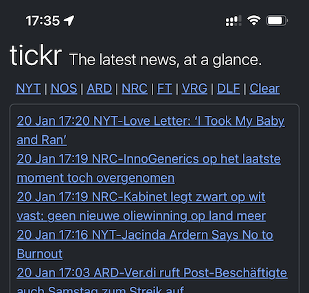

# Reader

Reader (branded **tickr** in the UI) is a single-user, web-based RSS reader written in Go.

It polls a list of RSS feeds and displays them in a "news ticker" style: a timestamp, a tag identifying the source, and a headline. Click a headline to expand a preview, a link to the article, and Save/Share actions.



On top of the plain ticker it adds:

- **AI headline scoring** — an LLM flags headlines that look like breaking news, which are then colour-coded in the list.
- **A live ticker** — new items are pushed to the browser over a WebSocket as they are ingested, without a page reload.
- **Keyword filters** — per-user keywords that either force-highlight a headline or redact it.
- **Saved stories** — bookmark items to a per-user list.
- **Archive lookups** — helper routes that bounce a story link to archive.is or the Wayback Machine.

## Requirements

- Go 1.23 or later (the module pins toolchain 1.24.1).
- A C toolchain, because the SQLite driver (`mattn/go-sqlite3`) is cgo-based.
- An OpenAI API key, if you want headline scoring. Without one, run with `-ai=false`.

## Layout

```
main.go            flag parsing, config, DB bootstrap, route table, graceful shutdown
handlers.go        HTTP handlers (headlines, login, feeds, keywords, saved, websocket, archive)
html.go            template paths and the feeds.Item -> HeadlineItem view model
breaking.go        AI scoring loop and scheduler
caching.go         read-through cache helpers for feeds/items/keywords
ingest.go          periodic feed update loop
helpers.go         input validation and URL expansion
internal/feeds     Feed/Item models, RSS ingestion, queries
internal/users     users, JWT session middleware, keywords, saved items
internal/openai    OpenAI chat-completion client, prompt handling, cost tracking
internal/newsticker  fan-out of newly ingested items to connected websocket clients
internal/cache     small in-memory TTL cache
cmd/archive        standalone poller that archives feeds into a separate database
cmd/ptest          offline A/B comparison of two scoring prompts
www/               HTML fragments, templates, CSS, JS, icons
```

## Configuration

Reader reads a YAML config file at startup (default `./db/config.yaml`). Copy `config-sample.yaml` there and edit it.

| Key | Meaning |
| --- | --- |
| `updateFrequency` | Minutes between feed polls. |
| `gmtOffset` | Fixed hour offset from GMT, used only if `timezone` is empty. |
| `timezone` | tzdata name (e.g. `Europe/Amsterdam`). Takes precedence over `gmtOffset`. |
| `resultsPerPage` | Headlines per page. |
| `openAiToken` | OpenAI API key. Required unless you run with `-ai=false`. |
| `secret` | Currently unused — session keys are generated randomly at startup. |
| `deeplApiKey` | Currently unused — reserved for a translation feature. |

> [!NOTE]
> A missing or unreadable config file is fatal — Reader panics at startup rather than falling back to defaults.

## Command-line flags

```
  -ai
    	AI headline scoring active; turn off for testing to avoid charges (default true)
  -config string
    	File path to a yaml config file (default "./db/config.yaml")
  -db string
    	File path to sqlite database (default "./db/reader.db")
  -debug
    	Activate debug options and logging
  -promptfile string
    	File containing the GPT prompt for headline scoring (default "db/gpt-prompt.txt")
  -register
    	Allow registration once at startup
```

The listen address is hard-coded to `:8000`.

`-debug` also starts a headline simulator that injects a nonsense headline into the live ticker every 15 seconds, which is handy for testing the WebSocket path without waiting for real news.

## Running it

Reader resolves several paths relative to the working directory, so always start it from the repository root:

- `./db/` must exist — it holds `reader.db`, `config.yaml`, the optional `gpt-prompt.txt`, and `apistats.db` (opened by `internal/openai` at package init, before any flags are read).
- `./www/` must exist — templates and static files are read from disk on every request, not embedded.

### Dev / testing

```
mkdir -p db
cp config-sample.yaml db/config.yaml
$EDITOR db/config.yaml
go run . -ai=false
```

Then open `localhost:8000`. `-ai=false` avoids OpenAI charges.

### Production

I have Reader running behind an NGINX reverse proxy. Clone the repo, build with `go build`, and write a small launcher script that sets the flags you want:

```bash
#!/usr/bin/bash
cd /home/user/reader
./reader
```

Then create `~/.config/systemd/user/reader.service`:

```systemd
[Unit]
Description=Reader, a simple RSS reader
After=network.target

[Service]
ExecStart=[...path...]/reader.sh
Type=simple
Restart=on-failure

[Install]
WantedBy=default.target
```

systemd should pick it up from there.

> [!WARNING]
> When running `start/stop/restart/enable` etc., you need to use `systemctl --user`. Without the `--user` option, systemctl will not find the service file.
> Additionally, a user service running under systemd only starts at login, not at boot. Run `loginctl enable-linger [username]` to have Reader start at boot.

> [!IMPORTANT]
> The reverse proxy must forward WebSocket upgrade headers on `/newsticker/`, or the live ticker will not connect. See [Live ticker](#live-ticker) for the hard-coded hostname that also needs changing.

### Account creation

- The first time Reader runs, it will allow anyone to create an account. On the homepage, enter a user name and password and click 'register'. Once you've done this, registrations close automatically and nobody else can create an account. (This is assumed to be a single-user instance.)
- *Troubleshooting:* Registration only opens when Reader starts and does not find a database. If you start Reader and stop it again without creating an account, registration will be closed on the next start, because the database now exists. Solution: start with the `-register` flag.
- Usernames must be letters only. Passwords are stored as bcrypt hashes.

## How it works

### Ingestion

`feeds.UpdateFeeds` polls every configured feed concurrently on a ticker (`updateFrequency` minutes). Duplicates are avoided by storing a base64-encoded SHA-1 of the item link in a unique-indexed column and inserting with GORM's `FirstOrCreate`. Items without a parseable publish date are skipped; publish dates in the future are clamped to now. The description is stripped of HTML tags and truncated to 450 runes.

On seeding a fresh database, four feeds are added by default (NYT Wire, NOS, Tagesschau, CNBC Business). Feeds are managed at `/feeds/`.

### Breaking news scoring

Reader scores headlines with **`gpt-4o-mini`** through the OpenAI chat-completions API. The model is prompted to identify high-priority news through the system prompt.

The system prompt is editable; set it with the `-promptfile` option. If the file is missing, the default is used (see `const defaultPrompt` in `internal/openai`).

For context, the current date and the last 10 headlines that scored above 84 are appended to the system prompt, so the model can avoid re-flagging a story it already flagged.

To ensure we get valid JSON back, the request uses the `response_format` option ([see API docs](https://platform.openai.com/docs/api-reference/chat/create#chat-create-response_format)). The model returns a `news` array of objects with `ID`, `headline`, `confidence` (0-100) and `reason`.

Scheduling: after every feed update, a scoring loop starts on a one-minute ticker. It scores 20 unscored headlines at a time and stops once fewer than 15 unscored headlines remain or the oldest unscored headline is more than five hours old. Headlines the model does *not* pick get a score of `-1` so they are never re-submitted.

Scores map onto the display as follows:

| Score | Class |
| --- | --- |
| > 90 | `alert` |
| > 80 | `rush` |
| > 70 | `highlight` |

Token usage and estimated cost accumulate in `db/apistats.db`. The per-model prices in `internal/openai` are hard-coded and will drift from OpenAI's actual pricing.

`cmd/ptest` scores the same 100 headlines with two different prompt files and prints a semicolon-separated comparison, which is how prompt changes get evaluated:

```
go run ./cmd/ptest -p1 cmd/ptest/prompt1.txt -p2 cmd/ptest/prompt2.txt -db ./db/reader.db -apikey sk-...
```

### Live ticker

New items are pushed onto a buffered channel during ingestion. `internal/newsticker` consumes that channel and fans each item out to the per-user channels of everyone connected to `/newsticker/`, which upgrades to a WebSocket and streams items as JSON. One connection per user; a second one gets `409 Conflict`. Slow or blocked consumers are skipped rather than blocking ingestion.

> [!WARNING]
> The hostname is hard-coded in two places: the accepted origin pattern in `newstickerHandler` (`handlers.go`) and the `wss://` URL in `www/main.html`. Both currently say `reader.unxpctd.xyz`. Change them if you host this yourself.

### Keywords

Each user can define keywords at `/keywords/` in one of two modes:

- **Highlight** — forces the headline to the `alert` class regardless of AI score.
- **Suppress** — marks the headline `redacted`; `www/static/js/redact.js` then draws a hand-drawn-looking black bar over it in the browser.

Matching is whole-word, case-insensitive, on the alphanumeric characters of each word in the title. Keywords override the AI-derived class.

### Saved stories

The Save button on an expanded headline POSTs to `/saved/`, which stores a many-to-many association between the user and the item. `/saved/` lists them; each entry has a Remove button. The Share button uses the Web Share API and hides itself where that is unavailable.

### Archive helpers

- `/proxy/<url>` follows any 301 redirects to expand short links, strips query parameters, and redirects to `https://archive.is/newest/<url>`.
- `/archiveorg/?url=<url>` queries the Wayback availability API and redirects to the closest snapshot.

Both routes are currently commented out in `www/main.html`, so they are reachable but not linked from the UI.

### Sessions

Login sets an HttpOnly `jwt-session` cookie containing an HS256 JWT valid for three weeks. **The signing key is generated randomly at every process start**, so restarting Reader logs everyone out.

### Caching

`internal/cache` is a mutex-guarded in-memory map with per-entry expiry, swept every five minutes. Item queries are cached for 15 minutes, the feed list for 6 hours, and per-user keyword lists for an hour (invalidated on edit). Nothing survives a restart.

## The archive tool

`cmd/archive` is a separate binary that polls feeds into its own database, for keeping a long-term record of certain feeds:

```
go build -o archive ./cmd/archive
./archive -db ./archive.db add https://example.com/feed.xml EX   # register a feed
./archive -db ./archive.db                                       # poll and store
```

It reuses `internal/feeds`, so the schema matches Reader's, but it does no scoring and serves no UI. Run it from cron.

## Reading the news

Click a headline to expand it. All article links open in a new tab. Filter by feed or search with the controls at the top of the page; search terms must be alphanumeric.
